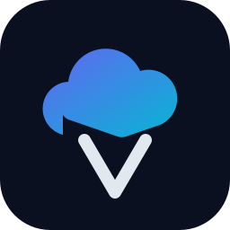

<div align="center">

#  VRCX-Cloud

### Your VRChat social life, served from your own server.

**Self-hosted, single-account web companion for VRChat** — the full VRCX-0
experience in a browser, powered by one Rust binary that runs beside your
desktop VRCX-0 and converges with it over a PostgreSQL sync mesh.

> 🛠️ This project is a modified fork (魔改版) of
> [VRCX-0](https://github.com/Map1en/VRCX-0) by
> [Map1en](https://github.com/Map1en) — all credit for the underlying
> runtime and sync engine goes upstream.
>
> 🔗 The desktop client that pairs with this project over the sync mesh
> (its local database converges with the same remote PostgreSQL) is
> **[Ero-Cat/vrcx-0](https://github.com/Ero-Cat/vrcx-0)**.

[](https://github.com/Ero-Cat/VRCX-Cloud/releases)
[](LICENSE)
[](Cargo.toml)
[](package.json)
[](.env.example)

**[Quickstart](#-quickstart) · [Features](#-features) · [Install](#-installation) · [Usage](#-usage-manual) · [Philosophy](#%EF%B8%8F-why-another-vrcx) · [FAQ](#-faq)**

**English** · [简体中文](README.zh-CN.md)

</div>

---

## 📑 Table of Contents

- [What is it?](#-what-is-it)
- [✨ Features](#-features)
- [🚀 Quickstart](#-quickstart)
- [📦 Installation](#-installation)
    - [Docker Compose (recommended)](#docker-compose-recommended)
    - [Bare metal](#bare-metal)
    - [Configuration reference](#%EF%B8%8F-configuration-reference)
- [📖 Usage manual](#-usage-manual)
    - [First login](#first-login)
    - [Pairing your desktop VRCX-0](#pairing-your-desktop-vrcx-0)
    - [Desktop-aware realtime handoff](#desktop-aware-realtime-handoff)
    - [Day-to-day](#day-to-day)
- [🎥 Demo](#-demo)
- [🏗 Architecture](#%EF%B8%8F-architecture)
- [🤔 Why another VRCX?](#%EF%B8%8F-why-another-vrcx)
- [❓ FAQ](#-faq)
- [🔒 Security notes](#-security-notes)
- [🤝 Credits](#-credits)

---

## 🌥 What is it?

```
 ┌──────────┐  HTTP/WS   ┌────────────────┐            ┌────────────┐
 │ Browser  │───────────▶│ vrcx-0-server  │──sync─────▶│ PostgreSQL │
 │ (anywhere│            │  · VRChat live │◀──sync─────│   (yours)  │
 │  on LAN) │            │  · full data   │            └─────▲──────┘
 └──────────┘            └────────────────┘                  │ sync
                                        ┌───────────────────┴─────┐
                                        │  Desktop VRCX-0 (games, │
                                        │  logs, screenshots)     │
                                        └─────────────────────────┘
```

VRCX-Cloud runs a **complete VRCX runtime as a server**: it keeps its own
VRChat realtime session, serves the entire VRCX-0 web UI, and syncs every
row with your desktop VRCX-0 through the built-in SQLite↔PostgreSQL
protocol. Game logs recorded on your PC show up on the web; memos you
write on the web land on your desktop — within one sync interval.

## ✨ Features

|     | Feature                            | Notes                                                                                                                                                                     |
| --- | ---------------------------------- | ------------------------------------------------------------------------------------------------------------------------------------------------------------------------- |
| 🖥   | **Full VRCX-0 UI in the browser**  | feed, friends, game-log history, favorites, notifications, stats graphs, AI assistant — the same React app, served by the server                                          |
| ⚡  | **Server-side VRChat session**     | login (incl. 2FA) once in the browser; the server keeps a realtime websocket so the web stays live even with the desktop off                                              |
| 🔁  | **Bidirectional sync mesh**        | op-log protocol with HLC conflict arbitration, idempotent pushes, resume-after-restart — shared with desktop VRCX-0                                                       |
| 🤝  | **Desktop-aware handoff**          | while your desktop VRCX-0 is actively syncing, the server pauses its own VRChat session and lets the desktop collect — no doubled API traffic, no doubled feed rows       |
| 🧠  | **344-command API**                | the exact desktop command surface over `POST /api/invoke` + WebSocket events                                                                                              |
| 🔐  | **Single-password web auth**       | cookie sessions, login rate-limit, explicit LAN-open mode                                                                                                                 |
| 🐳  | **One container**                  | server + PostgreSQL via docker-compose; single binary for bare metal                                                                                                      |
| 🧩  | **Graceful degradation**           | desktop-only features (game launch, VR overlay, tray) are reported unsupported and hidden automatically                                                                   |
| 🔍  | **Social analytics**               | bio diff history, status-light distribution, shared-instance query (with the mutual-start marker), and a social density timeline — all derived from the feed event stream |
| 🕸   | **Graph enhancements**             | manual links and pinned non-friend nodes join the mutual-friends graph, stored separately from API data and synced across devices                                         |
| 👁   | **Watched users (off by default)** | polls public profile changes of non-friends into your feed; only data your account can already see                                                                        |

## 🚀 Quickstart

```bash
git clone https://github.com/Ero-Cat/VRCX-Cloud.git
cd VRCX-Cloud

cp .env.example .env      # set VRCX_CLOUD_SYNC_HOST + PASSWORD — that's all
docker compose up -d --build

open http://localhost:8800   # no login step (trusted LAN)
```

You will land on the VRChat login page. Enter your VRChat credentials
(2FA supported) and the server takes over the session. That's it —
[pair your desktop](#pairing-your-desktop-vrcx-0) whenever you're ready.

## 📦 Installation

### Docker Compose (recommended)

```bash
cp .env.example .env      # set VRCX_CLOUD_SYNC_HOST + PASSWORD — that's all
docker compose up -d --build
```

Services started:

| Service | Address              | Purpose                                |
| ------- | -------------------- | -------------------------------------- |
| `app`   | `http://<host>:8800` | VRCX-Cloud web server (BYO PostgreSQL) |

### Automated updates (optional)

Every push to `master` builds an image on GitHub Actions and publishes it
to `ghcr.io/ero-cat/vrcx-cloud:latest`. A server-side systemd timer polls
it and redeploys when the digest changes — outbound-only, works behind
NAT, no server credentials in the repo:

```bash
# one-time on the deployment host (clone + .env already in place)
cp deploy/vrcx-cloud-update.{service,timer} /etc/systemd/system/   # adjust paths if the clone isn't at /opt/VRCX-Cloud
systemctl daemon-reload && systemctl enable --now vrcx-cloud-update.timer
```

After the first successful build, set the package visibility on GitHub
(Public pulls anonymously; Private needs a `read:packages` PAT and
`docker login ghcr.io` on the server).

### Bare metal

Requirements: Rust 1.85+, Node 24, a reachable PostgreSQL server.

```bash
npm ci && npm run build                    # frontend -> dist/
cargo build --release -p vrcx-0-server

VRCX_CLOUD_DATA_DIR=/var/lib/vrcx-cloud \
VRCX_CLOUD_SYNC_HOST=127.0.0.1 VRCX_CLOUD_SYNC_PASSWORD=... \
./target/release/vrcx-0-server
```

### ⚙️ Configuration reference

Environment variables (or `server.toml`, path via `VRCX_CLOUD_CONFIG`).
Sync needs only `VRCX_CLOUD_SYNC_HOST` + `VRCX_CLOUD_SYNC_PASSWORD`; the
remaining connection fields default to the values shown.

| Env                               | TOML                      | Default                  | Meaning                                                                 |
| --------------------------------- | ------------------------- | ------------------------ | ----------------------------------------------------------------------- |
| `VRCX_CLOUD_DATA_DIR`             | `[server] data_dir`       | `<config>/VRCX-0-Server` | SQLite profile + image cache                                            |
| `VRCX_CLOUD_LISTEN`               | `[server] listen_addr`    | `0.0.0.0:8800`           | HTTP listen address                                                     |
| `VRCX_CLOUD_DIST_DIR`             | `[web] dist_dir`          | `./dist`                 | frontend static files                                                   |
| `VRCX_CLOUD_SYNC_HOST`            | `[sync] host`             | — (required)             | remote sync PostgreSQL host                                             |
| `VRCX_CLOUD_SYNC_PASSWORD`        | `[sync] password`         | — (required)             | remote sync PostgreSQL password                                         |
| `VRCX_CLOUD_SYNC_PORT`            | `[sync] port`             | `5432`                   | remote sync PostgreSQL port                                             |
| `VRCX_CLOUD_SYNC_USER`            | `[sync] user`             | `vrcx`                   | remote sync PostgreSQL user                                             |
| `VRCX_CLOUD_SYNC_DATABASE`        | `[sync] database`         | `vrcx`                   | remote sync PostgreSQL database                                         |
| `VRCX_CLOUD_SYNC_INTERVAL_SEC`    | `[sync] interval_sec`     | `15`                     | sync cadence (5–3600)                                                   |
| `VRCX_CLOUD_SYNC_ALLOW_PLAINTEXT` | `[sync] allow_plaintext`  | `true`                   | set `false` when your PostgreSQL requires TLS                           |
| `VRCX_CLOUD_REALTIME_MODE`        | `[realtime] mode`         | `auto`                   | `auto`: pause server session while desktop active; `always`: keep it on |
| `VRCX_CLOUD_FEED_LOGGING`         | `[realtime] feed_logging` | `true`                   | `false`: server never records feed rows (desktop is recorder)           |

## 📖 Usage manual

### First login

1. Open `http://<server>:8800`.
2. On the VRChat login page, sign in with your account (TOTP / email OTP
   supported). The server stores the session encrypted at rest.
3. The app opens on your feed. Data that existed only on your desktop
   arrives after [pairing](#pairing-your-desktop-vrcx-0).

### Pairing your desktop VRCX-0

The desktop build that pairs with this project is
**[Ero-Cat/vrcx-0](https://github.com/Ero-Cat/vrcx-0)** — a VRCX-0 fork
shipping the same sync engine, so its local database converges with the
remote PostgreSQL this server uses:

1. Desktop VRCX-0 → **Settings → Data Sync**.
2. Enter the PostgreSQL connection your server uses:
   host `<server>`, port `5432`, user/password/database from your `.env`.
   Tick _allow unencrypted connection_ on trusted LANs without TLS.
3. Press **Test connection**, then enable. First sync does a full
   bootstrap; afterwards both directions converge every interval.

> Order doesn't matter: server-first or desktop-first both converge.

### Desktop-aware realtime handoff

With `[realtime] mode = auto` (default), the server watches sync-device
activity:

- **Desktop active** (pushed/pulled within ~90 s) → the server closes its
  own VRChat websocket and idles. Zero duplicate sessions, zero duplicate
  feed rows; the web keeps working off synced data.
- **Desktop quiet** → the server reconnects its own session and the web
  goes fully realtime again (e.g. desktop shut down for the night).

Set `mode = "always"` if you want the server session on at all times, or
`feed_logging = false` if the desktop should forever remain the recorder.

### Day to day

- **Feed / friends / history** — realtime while the server session is on;
  synced-latency (≤ your sync interval) otherwise.
- **Game logs** (join/leave, video plays, on-play player lists) are
  recorded by the desktop from VRChat's log files and appear on the web.
- **Favorites, invites, notifications** — the web talks to VRChat's API
  directly through the server session.
- **Data Sync panel** (Settings → Sync) shows every device, its last
  push/pull, and a _Sync now_ button — on both web and desktop.

## 🎥 Demo

A first-boot walkthrough (VRChat login → feed):

```
$ docker compose up -d --build
 ✔ Container vrcx-cloud-postgres-1  Healthy
 ✔ Container vrcx-cloud-app-1        Started

$ curl -s localhost:8800/healthz
{"ok":true,"phase":"Running","authStatus":"Authenticated",...}

Browser → http://localhost:8800
 ├─ VRChat login (2FA) … done — session restored on restart
 ├─ Settings → Data Sync → desktop device "PC-Win11" last pull: 12s ago
 └─ desktop joins a world → 15s later the web feed shows it
```

> Real screencast coming with the first tagged release.

## 🏗 Architecture

| Piece                                            | What it is                                                                                                                                        |
| ------------------------------------------------ | ------------------------------------------------------------------------------------------------------------------------------------------------- |
| `crates/server`                                  | axum binary: auth, `POST /api/invoke` dispatcher (344 commands), `/api/events` WebSocket, `/api/img` cache, SPA hosting, realtime gate supervisor |
| `crates/runtime-host-server`                     | server runtime facade over the composition root (`RuntimeHostProfile::Server`)                                                                    |
| `crates/application-sync`                        | the op-log sync engine shared with desktop VRCX-0                                                                                                 |
| `crates/*` (application, realtime, persistence…) | the VRCX domain core, unchanged from VRCX-0                                                                                                       |
| `src/`                                           | the VRCX-0 React app; `webTransport.ts` switches invoke/events to HTTP/WS in browsers                                                             |

Desktop-only subsystems (game-log watcher, VR overlay, tray, updater,
registry backup, TTS) were removed rather than disabled — the server tree
contains no dead desktop code.

## 🧹 Disk hygiene

Rust `target/` grows fast (this workspace's debug artifacts reached 25 GB
during heavy development). Keep it in check:

```bash
npm run rust:clean:debug        # drop target/debug (biggest win, anytime)
scripts/cargo-target-hygiene.sh # incremental caches + cargo-sweep >30d
npm run rust:clean              # full cargo clean
```

The workspace already compiles with `debug = "line-tables-only"` and
skips debuginfo for dependencies; if you work across many Rust repos,
point `CARGO_TARGET_DIR` at one shared directory to stop per-project
duplication.

## 🤔 Why another VRCX?

- **VRCX and VRCX-0 are desktop apps.** If your PC is off — or you just
  want to check a friend's world from your phone — there was no story.
  VRCX-Cloud makes the _server_ the always-on device.
- **One account, many screens.** This is deliberately _not_ multi-tenant
  SaaS: it's your data, your box, your LAN (or tailnet). No accounts
  service, no analytics, no public exposure by design.
- **Don't fight the desktop — join it.** Instead of porting VRCX's
  storage to PostgreSQL, VRCX-Cloud reuses VRCX-0's own sync engine, so
  desktop and server are always peers in one mesh, and the heavier
  desktop-only duties (game logs, screenshots) stay where they belong.
- **Rust all the way.** The entire backend is the battle-tested VRCX-0
  codebase (~250k lines) with a new axum shell — not a rewrite.

## ❓ FAQ

**Does the web work while my PC is off?**
Yes — that's the point. The server keeps its own VRChat session
(`realtime mode = auto` hands off when the desktop _is_ active and takes
over when it isn't).

**Will two sessions get my VRChat account flagged?**
Possibly — any automation carries risk. Keep `[realtime] mode = auto` so
the server idles while you play; consider an outbound proxy if your
server's IP differs wildly from your usual one. First login from a new IP
may hit a captcha (there is no auto-solve).

**Where does my data live?**
Server data dir (SQLite + image cache, encrypted VRChat session at rest)
and your PostgreSQL. Nothing leaves your network; telemetry is compiled
out.

**Multiple VRChat accounts?**
One server = one account, by design. Run a second compose stack for a
second account.

**Can I expose it to the internet?**
Behind a VPN (Tailscale/WireGuard), sure. Directly? Please don't — the
web layer fronts your full VRChat session.

**How do upgrades work?**
With the update timer installed: push to `master` → image builds on
GitHub → the server picks it up within a minute. Manually:
`git pull && docker compose up -d --build`. The sync protocol is
version-guarded; desktop and server versions can differ briefly.

## 🔒 Security notes

- Web UI: no built-in auth — trusted-LAN posture only; front it with a
  reverse proxy (TLS + basic auth) before exposing it beyond your LAN.
- PostgreSQL: per-deployment credentials, TLS optional for trusted LANs,
  never exposed publicly by the compose file.
- VRChat session cookie: encrypted at rest with a machine-derived key.
- Keep server + desktop NTP-synced — sync arbitration uses hybrid logical
  clocks.
- The **watched users** feature is off by default; when enabled it only
  polls public profile data your account can already see (VRChat hides
  status from non-friends on orange/red), and the results stay in your own
  database.

## 🤝 Credits

- **[VRCX-0](https://github.com/Map1en/VRCX-0)** by Map1en — the Rust
  rewrite this project is forked from, and the sync engine both sides
  share.
- **[Ero-Cat/vrcx-0](https://github.com/Ero-Cat/vrcx-0)** — the
  companion desktop client this server is designed to pair with over
  the sync mesh (desktop database ⇄ remote PostgreSQL).
- **[VRCX](https://github.com/vrcx-team/VRCX)** — the original Electron
  companion, and its community.
- VRChat is a trademark of VRChat Inc. This project is not affiliated
  with or endorsed by VRChat Inc.

---

<div align="center">

**[⬆ back to top](#-table-of-contents)**

GPL-3.0 · forked with ❤️ from VRCX-0

</div>
